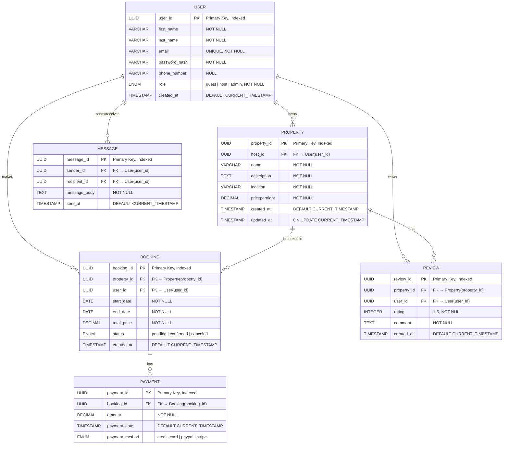

# Database Specification - AirBnB
### Entities and Attributes

```mermaid
erDiagram

    USER {
        UUID user_id PK "Primary Key, Indexed"
        VARCHAR first_name "NOT NULL"
        VARCHAR last_name "NOT NULL"
        VARCHAR email "UNIQUE, NOT NULL"
        VARCHAR password_hash "NOT NULL"
        VARCHAR phone_number "NULL"
        ENUM role "guest | host | admin, NOT NULL"
        TIMESTAMP created_at "DEFAULT CURRENT_TIMESTAMP"
    }

    PROPERTY {
        UUID property_id PK "Primary Key, Indexed"
        UUID host_id FK "FK → User(user_id)"
        VARCHAR name "NOT NULL"
        TEXT description "NOT NULL"
        VARCHAR location "NOT NULL"
        DECIMAL pricepernight "NOT NULL"
        TIMESTAMP created_at "DEFAULT CURRENT_TIMESTAMP"
        TIMESTAMP updated_at "ON UPDATE CURRENT_TIMESTAMP"
    }

    BOOKING {
        UUID booking_id PK "Primary Key, Indexed"
        UUID property_id FK "FK → Property(property_id)"
        UUID user_id FK "FK → User(user_id)"
        DATE start_date "NOT NULL"
        DATE end_date "NOT NULL"
        DECIMAL total_price "NOT NULL"
        ENUM status "pending | confirmed | canceled"
        TIMESTAMP created_at "DEFAULT CURRENT_TIMESTAMP"
    }

    PAYMENT {
        UUID payment_id PK "Primary Key, Indexed"
        UUID booking_id FK "FK → Booking(booking_id)"
        DECIMAL amount "NOT NULL"
        TIMESTAMP payment_date "DEFAULT CURRENT_TIMESTAMP"
        ENUM payment_method "credit_card | paypal | stripe"
    }

    REVIEW {
        UUID review_id PK "Primary Key, Indexed"
        UUID property_id FK "FK → Property(property_id)"
        UUID user_id FK "FK → User(user_id)"
        INTEGER rating "1-5, NOT NULL"
        TEXT comment "NOT NULL"
        TIMESTAMP created_at "DEFAULT CURRENT_TIMESTAMP"
    }

    MESSAGE {
        UUID message_id PK "Primary Key, Indexed"
        UUID sender_id FK "FK → User(user_id)"
        UUID recipient_id FK "FK → User(user_id)"
        TEXT message_body "NOT NULL"
        TIMESTAMP sent_at "DEFAULT CURRENT_TIMESTAMP"
    }

    %% Relationships
    USER ||--o{ PROPERTY : "hosts"
    USER ||--o{ BOOKING : "makes"
    USER ||--o{ REVIEW : "writes"
    USER ||--o{ MESSAGE : "sends/receives"
    PROPERTY ||--o{ BOOKING : "is booked in"
    PROPERTY ||--o{ REVIEW : "has"
    BOOKING ||--o{ PAYMENT : "has"
```